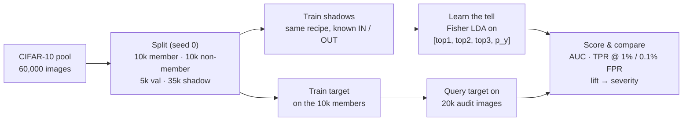
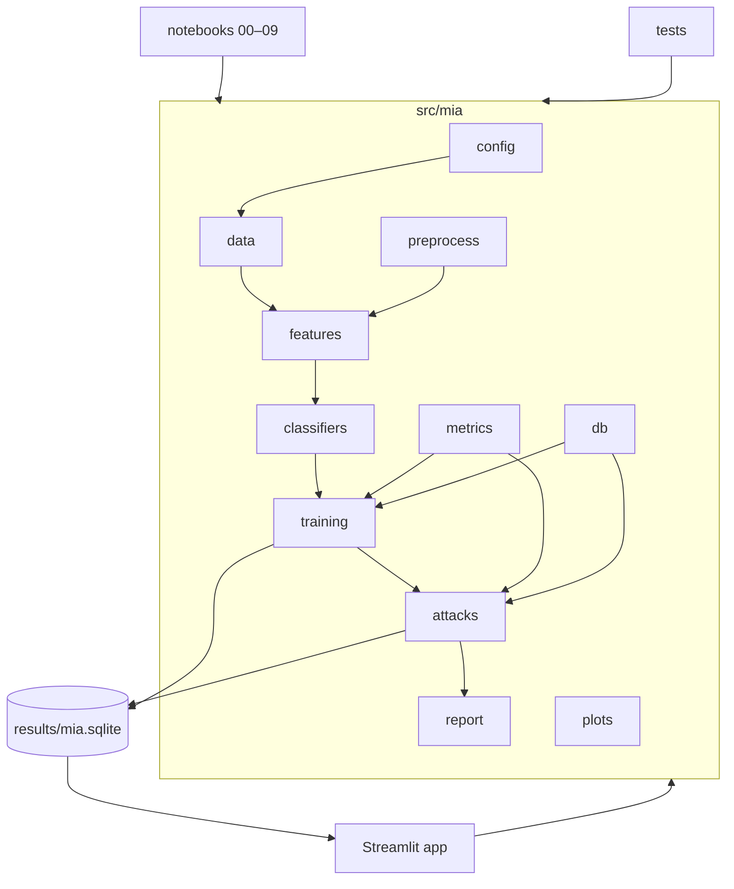
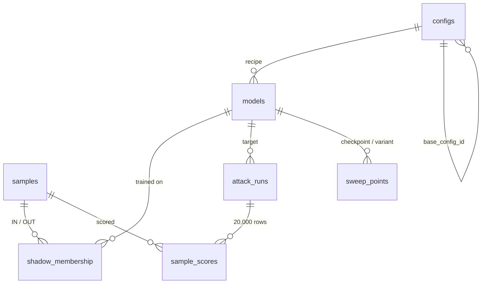

<div align="center">

# 🔍 P51 — Membership-Inference Audit of Image Classifiers

**Can an attacker tell whether a specific image was in your training set?**

We train seven CIFAR-10 classifiers, from a pure memoriser to a well-regularised model, attack every one of them,
connect the leakage to the generalisation gap, trace two mitigation curves, and write it all up as a responsible-disclosure report.


</div>

---

## Table of contents

1. [What this is](#what-this-is)
2. [How the attack works](#how-the-attack-works)
3. [Syllabus coverage](#syllabus-coverage)
4. [Quick start (Windows first)](#quick-start-windows-first)
5. [Hardware notes](#hardware-notes)
6. [The seven targets and six attacks](#the-seven-targets-and-six-attacks)
7. [Architecture](#architecture)
8. [Database](#database)
9. [The Streamlit app](#the-streamlit-app)
10. [Testing](#testing)
11. [Reproducibility](#reproducibility)
12. [Design decisions](#design-decisions)
13. [Results summary](#results-summary)
14. [Limitations](#limitations)

---

## What this is

A reproducible **privacy audit** of image classifiers trained on CIFAR-10. The question is *membership inference*: given one image and black-box access to a model's probability output, decide whether that image was part of the model's training set.

| Deliverable | Where |
|---|---|
| Attack AUC vs train–test gap across seven configurations (plus every sweep checkpoint) | Figure **F1**, page *Leakage vs Gap* |
| Mitigation curves for **early stopping** and **label smoothing** | Figures **F3**, **F4**, page *Mitigation Curves* |
| Security-style **responsible-disclosure report** | `results/reports/disclosure_report.md`, page *Disclosure Report* |
| Interactive demo: pick or upload an image and watch the attack decide | `streamlit run app/Home.py` |

Every model is built from syllabus material: hand-crafted descriptors (HOG, LBP, Gabor, DWT, colour histograms) after histogram processing and filtering, PCA/LDA, discriminant functions and nearest-neighbour rules, plus a lightweight **YOLO26 Nano** classifier trained from scratch. The attacks use syllabus methods too: **Fisher discriminant analysis** (supervised), **K-means** and **Fuzzy C-means** (unsupervised).

## How the attack works



Shadow models (Shokri et al., simplified) imitate the target on data the attacker *does* know the membership of. The attack model learns what a "training image" output looks like (very confident, low loss) and transfers that tell to the real target. Shadow-free attacks (loss, confidence, modified entropy, clustering) need no shadows at all.

## Syllabus coverage

| Syllabus unit / topic | Where it appears in this project |
|---|---|
| Fundamentals of image formation, colour spaces | RGB→BGR, YCrCb and HSV conversions in preprocessing and colour features |
| Transformations: Euclidean, affine | `cv2.warpAffine` rotation + translation + flip as data augmentation (config C4) |
| Fourier transform | Log-magnitude spectrum in the Feature Explorer page |
| Convolution and filtering | Gaussian smoothing; Gabor filter bank applied with `cv2.filter2D` |
| Image enhancement, histogram processing | CLAHE on the luminance channel; HSV colour histograms as features |
| Edge detection (Canny, LoG, DoG) | Edge maps in the Feature Explorer page (visual analysis of what leaks) |
| HOG, orientation histogram | 324-dim HOG descriptor (`cv2.HOGDescriptor`) |
| LBP and variants | Uniform LBP (P=8, R=1) histograms on a 2×2 grid |
| Gabor filters, DWT | 8-filter Gabor bank statistics; 2-level Haar DWT sub-band energies |
| Lightweight models (YOLO Nano) | YOLO26n-cls targets C6, C7 (2.8M parameters) |
| Classification: discriminant function | Softmax linear discriminant (C2, C3, C4), Fisher LDA classifier (C5) |
| Supervised / unsupervised classification | 1-NN (C1), YOLO (C6, C7); attacks via LDA (supervised), K-means and FCM (unsupervised) |
| Clustering: K-means, Fuzzy C-means | Unsupervised membership attacks A5, A6 |
| Dimensionality reduction: PCA, LDA | PCA-64 front end for C3–C5; Fisher LDA in C5 and attack A1 |
| Energy-efficient edge models | Parameter count, model size and ms/image reported for every target |
| Applications: CBIR, biometrics | C1 is a nearest-neighbour retrieval engine (CBIR); biometrics as motivation |

**Deliberately out of scope:** ResNet/VGG/ViT backbones, ImageNet transfer learning, GANs/diffusion, likelihood-ratio attacks (LiRA/RMIA) and differential privacy. They are named only as future work.

## Quick start (Windows first)

The project targets **Windows 10/11 with an NVIDIA GPU** (e.g. an HP Victus laptop) and also runs unchanged on macOS and Linux.

### 1. Environment

```powershell
git clone https://github.com/Kavaykhurana/p51-mia-audit.git
cd p51-mia-audit
py -3.11 -m venv .venv
.venv\Scripts\activate
python -m pip install --upgrade pip
pip install -r requirements.txt
```

<details>
<summary>macOS / Linux</summary>

```bash
python3.11 -m venv .venv && source .venv/bin/activate
pip install -r requirements.txt
```
</details>

### 2. Use the GPU (Windows + NVIDIA)

`pip install ultralytics` pulls a **CPU-only** PyTorch on Windows. Replace it with the CUDA build that matches your driver (see [pytorch.org](https://pytorch.org/get-started/locally/); `nvidia-smi` shows the driver's CUDA version):

```powershell
pip install --force-reinstall torch torchvision --index-url https://download.pytorch.org/whl/cu128
python -c "import torch; print(torch.cuda.is_available(), torch.cuda.get_device_name(0))"
```

`False` is acceptable: YOLO falls back to the CPU with a printed warning and trains roughly 10× slower.

### 3. Run the notebooks in order

```powershell
jupyter lab
```

Open `notebooks/` and run each notebook top to bottom:

| # | Notebook | What it does | Rough estimate |
|---|---|---|---|
| 00 | `00_setup_and_split` | Environment check, DB, CIFAR-10 download, split, 10×10 grid | 2–5 min |
| 01 | `01_preprocessing_and_features` | Every descriptor visualised; 60,000 × 426 feature cache | < 2 min |
| 02 | `02_train_classical_targets` | C1–C5 targets (softmax configs × 3 seeds, C2 × 8 checkpoints) | ~10 min |
| 03 | `03_train_yolo_targets` | C6 and C7 YOLO26n-cls targets | GPU: ~20 min each |
| 04 | `04_train_shadows` | 16 shadows per classical recipe, 4 per YOLO recipe | GPU: ~2 h |
| 05 | `05_attacks` | All seven attacks on every target and checkpoint | ~30 min |
| 06 | `06_sweep_early_stopping` | Early-stopping frontier, F3 | < 1 min |
| 07 | `07_sweep_label_smoothing` | C2/C3 × ε ∈ {0.05…0.5}, 16 shadows each, F4 | ~30 min |
| 08 | `08_analysis_and_figures` | Spearman ρ, F1–F7, results CSV, fills this README | ~2 min |
| 09 | `09_disclosure_report` | Renders the disclosure report | seconds |

Every notebook is **idempotent**: it checks `results/mia.sqlite` and skips models and attack runs that already exist, so an interrupted run resumes where it stopped.

<details>
<summary>Run everything headless (PowerShell)</summary>

```powershell
Get-ChildItem notebooks\*.ipynb | Sort-Object Name | ForEach-Object {
    jupyter nbconvert --to notebook --execute --inplace --ExecutePreprocessor.timeout=-1 $_.FullName
}
```
</details>

### 4. Launch the demo

```powershell
streamlit run app/Home.py
```

### 5. Tests

```powershell
pytest -q
```

## Hardware notes

- **Classical models (C1–C5, label-smoothing sweep)** run on the CPU in minutes; features take about 0.5 ms per image.
- **YOLO (C6, C7)** uses `device=0` when CUDA is available and the CPU otherwise. On a laptop RTX GPU, 100 epochs at `imgsz=64` take roughly 15–25 minutes per model; there are 10 YOLO training runs (2 targets + 8 shadows).
- **CUDA out of memory** is retried automatically with batch 128, then 64.
- **Disk:** about 5 GB in total (CIFAR + PNG exports + checkpoints + a database of several hundred MB, because it stores a score for each of the 20,000 audit images in every attack run).

## The seven targets and six attacks

### Targets (`config/experiment.yaml` is the single source of truth)

| ID | Name | Pipeline | Key settings | Expected gap |
|---|---|---|---|---|
| C1 | Memoriser | Standardise → soft 1-NN | τ = median distance on the validation set | Very large (train acc = 100%) |
| C2 | Raw discriminant | Standardise → softmax discriminant on 426 dims | λ = 0, 200 epochs, checkpoints 1…200 | Large |
| C3 | PCA discriminant | Standardise → PCA-64 → softmax discriminant | λ = 1e-3, 200 epochs | Medium |
| C4 | PCA + affine aug. | C3 + 2 affine copies per training image | as C3 | Small–medium |
| C5 | Fisher LDA | Standardise → PCA-64 → LDA (Ledoit-Wolf shrinkage) | closed form | Small |
| C6 | YOLO Nano, no aug. | YOLO26n-cls from scratch | no augmentation, dropout 0, checkpoints 5…100 | Large |
| C7 | YOLO Nano, regularised | YOLO26n-cls from scratch | flips, scale, erasing, RandAugment, dropout 0.2, patience 15 | Small |

### Attacks (score convention: higher = more likely member)

| ID | Attack | Shadows | Score |
|---|---|:---:|---|
| A1 | Shokri-simplified, Fisher LDA | ✓ | LDA decision function on `[top1, top2, top3, p_y]`, trained on shadow IN/OUT |
| A1b | Shokri per-class | ✓ | One LDA per true class |
| A2 | Loss threshold (Yeom et al.) | – | `−loss = log p_y` |
| A3 | Confidence threshold | – | `p_y` |
| A4 | Modified entropy (Song & Mittal) | – | `−Mentr(p, y)` |
| A5 | K-means, k = 2 | – | Hard cluster; one (TPR, FPR) point |
| A6 | Fuzzy C-means, c = 2, m = 2 | – | Membership degree in the "member" cluster |

**Metrics** on the 20,000 audit images: ROC-AUC with a 95% bootstrap CI (1,000 stratified resamples), advantage = max(TPR − FPR), **TPR at 1% and 0.1% FPR**, lift λ = TPR@0.1% / 0.001 and a severity rating:

| Severity | Low | Moderate | High | Critical |
|---|---|---|---|---|
| Lift λ | < 2 | 2 – 10 | 10 – 50 | ≥ 50 |

## Architecture

```
p51-mia-audit/
├── config/experiment.yaml        # split sizes, seeds, every config's hyper-parameters
├── src/mia/                      # importable library shared by notebooks, app and tests
│   ├── config.py                 # YAML → frozen dataclasses, validation, all paths
│   ├── data.py                   # CIFAR download/parse (RGB→BGR once), split, shadow sets, YOLO folders
│   ├── preprocess.py             # CLAHE + Gaussian enhancement, affine augmentation
│   ├── features.py               # HOG | uniform LBP | Gabor | Haar DWT | HSV → 426-d, feature cache
│   ├── visual.py                 # HOG glyphs, LBP map, Gabor grid, DWT mosaic, FFT, Canny/LoG/DoG
│   ├── classifiers.py            # SoftNN, SoftmaxDiscriminant, LDAClassifier, YoloClassifier
│   ├── training.py               # train targets/shadows, evaluate checkpoints, write the DB
│   ├── attacks.py                # A1–A6 and run_all_attacks
│   ├── metrics.py                # ROC/AUC, bootstrap CI, TPR@FPR, lift, Spearman + permutation test
│   ├── db.py                     # SQLite schema and helpers
│   ├── plots.py                  # figures F1–F7
│   └── report.py                 # disclosure report renderer (Jinja2)
├── notebooks/00 … 09             # the experiments, run in numeric order
├── app/                          # Streamlit app: Home + 5 pages
├── templates/disclosure_report.md.j2
├── tests/                        # features, metrics, attacks, database
├── data/  models/                # generated, git-ignored
└── results/{mia.sqlite, figures/, reports/}
```



## Database

One portable SQLite file, `results/mia.sqlite`, created by `src/mia/db.py` (foreign keys on, WAL journal). No server or credentials are needed.



| Table | One row per |
|---|---|
| `samples` | CIFAR-10 image (label, source split, partition) |
| `configs` | training recipe: C1–C7 and each label-smoothing variant (`C2_ls0.10`, …) |
| `models` | trained target or shadow, including every early-stopping checkpoint; `gap_acc` and `loss_ratio` are generated columns |
| `shadow_membership` | (shadow model, image) with IN = 1 / OUT = 0 |
| `attack_runs` | (target, attack, shadow recipe): AUC [CI], advantage, TPR@1%/0.1%, lift, severity, 1%-FPR threshold |
| `sample_scores` | (attack run, audit image) score |
| `sweep_points` | point on the early-stopping (x = epoch) or label-smoothing (x = ε) curve |
| `v_leakage_vs_gap` | view: best attack per target model joined with its gap |

Inspect it with any SQLite client, e.g. `python -c "import sqlite3; print(sqlite3.connect('results/mia.sqlite').execute('select count(*) from models').fetchone())"`.

## The Streamlit app

`streamlit run app/Home.py` opens a light-themed, six-page app:

| Page | What you can do |
|---|---|
| **Home** | The question, the pipeline, headline tiles (highest/lowest AUC, Spearman ρ, worst severity) and the C1–C7 table coloured by severity |
| **Feature Explorer** | Pick a member / non-member / validation image or upload one; see enhancement, HOG glyphs, LBP, Gabor, DWT, FFT, Canny/LoG/DoG, colour histograms and the full 426-d descriptor |
| **Leakage vs Gap** | Interactive F1/F2 with attack and family filters, ρ and p, CSV download |
| **Mitigation Curves** | Early-stopping and label-smoothing frontiers with a data-generated sentence on the accuracy cost |
| **Live Audit** | Pick a member or non-member (seeded), type an index or upload an image; see the class probabilities, the attack score, the 1%-FPR threshold, the verdict and whether it was right |
| **Disclosure Report** | The rendered report with Markdown and CSV downloads |

If the database or split file is missing, every page says so and shows the commands to run. Use **Refresh data** in the sidebar after re-running notebooks.

## Testing

```powershell
pytest -q
```

| File | Checks |
|---|---|
| `test_features.py` | Descriptor is (426,) float32, finite and deterministic; block lengths; LBP and HSV histograms sum to 1 |
| `test_metrics.py` | Perfect / reversed / random scores give AUC 1 / 0 / 0.5±0.02; TPR@FPR on a hand-built example; rank AUC equals sklearn |
| `test_attacks.py` | Loss, confidence, modified-entropy and FCM attacks separate a synthetic leaky model (AUC > 0.8) and fail on a non-leaky one; Shokri-LDA transfers from synthetic shadows |
| `test_db.py` | Schema creates; bad label and shadow-without-index are rejected; `gap_acc` is generated correctly |

## Reproducibility

- **Seeds everywhere:** split seed 0; shadow *k* uses `default_rng(1000 + k)` and `default_rng(2000 + k)`; SGD init/shuffle, PCA, augmentation, K-means, FCM and bootstrap all take explicit seeds.
- **Split file:** `data/splits/split_seed0.npz` holds every partition and every shadow's IN/OUT/val indices; notebook 00 verifies a regenerated split matches it.
- **Idempotent notebooks:** finished models and attack runs are skipped; failures are logged to `results/train_errors.log` and the batch continues.
- **The DB is the single source of truth:** the report, README results block and app read every number from it; nothing is hard-coded.
- **Leak-free by construction:** scalers, PCA and LDA are fitted only on each model's own training set; target non-members never appear in any shadow set or YOLO folder.

## Design decisions

- **No SIFT/SURF/Harris features.** They are in the syllabus, but keypoint detectors return too few stable points on 32×32 images to build a fixed-length descriptor.
- **Label smoothing is studied on our own discriminant, not YOLO.** Ultralytics does not document a `label_smoothing` training argument, so the controlled study uses `SoftmaxDiscriminant`, where ε enters the loss explicitly. ε = 0 reuses the base model.
- **Scalers and PCA are fitted per model** on that model's training set only, so a shadow never sees target data and the target never sees non-members.
- **Exact YOLO checkpoints.** Ultralytics' `save_period` names files by 0-based epoch index (`epoch5.pt` is written after 6 epochs), so an `on_model_save` callback copies `last.pt` to `e{N}.pt` exactly when N epochs have completed. C7 uses `best.pt` (early stopping, patience 15) and records the epoch it was saved at.
- **Model ids.** `{config}_{role}{k}_s{seed}`, plus `_e{epoch}` for configs that save several checkpoints (C2, C6). The headline C2 model is therefore `C2_target_s0_e200` and C6 is `C6_target_s0_e100`.
- **Shadows use the recipe's first seed (0);** they differ through their data (shadow *k*), as in the specification's example ids.
- **Probability caches.** Every model's outputs on its IN/OUT sets are stored in `models/probs/<model_id>.npz` at training time, so attacks never re-run inference.
- **Inference time is pixels → probabilities**, so classical models include descriptor extraction; this is what an edge deployment would pay.
- **C4 augmentation seed** is the model seed for targets and `seed + 10000·(k+1)` for shadow *k*.
- **Bootstrap CI** uses the Mann-Whitney (rank) form of AUC, identical to `roc_auc_score` (a test checks this) and about 3× faster for 1,000 resamples.
- **`shadow_membership` rows** are written when each shadow is trained, because the table references `models`.
- **Uploaded images in Live Audit** ask for the true class (default: the predicted class), because every attack uses p of the true class. K-means returns a hard cluster label, so its verdict threshold is 0.5.
- **Mixed-precision check.** On CUDA, Ultralytics briefly downloads `yolo26n.pt` to test AMP support; it is never used to initialise or train our models (`pretrained=False`, architecture from `yolo26n-cls.yaml`).
- **Parameter count.** The brief's 2.8M figure is YOLO26n-cls with ImageNet's 1,000-class head; with CIFAR-10's 10 classes the network has about 1.5M parameters. The exact count of every trained model is stored in `models.n_params`.
- **Light theme** by default via `.streamlit/config.toml`.

## Results summary

Filled automatically by `notebooks/08_analysis_and_figures.ipynb` from the database.

<!-- RESULTS:START -->
*Not generated yet: run notebooks 00–08.*
<!-- RESULTS:END -->

Figures F1–F7 are written to `results/figures/` as PDF and 300-dpi PNG:

| ID | Figure |
|---|---|
| F1 | AUC vs accuracy gap (marker = family, bootstrap CI error bars, ρ in the legend) |
| F2 | AUC vs loss ratio (log x-axis) |
| F3 | Early-stopping frontier: test accuracy vs AUC and vs TPR@0.1% FPR |
| F4 | Label-smoothing frontier, same axes |
| F5 | Log-log ROC curves for C1–C7 (best attack each) |
| F6 | The 16 most-exposed member images for C2 and C7 |
| F7 | Cost vs leakage: ms/image and model size vs AUC |

## Limitations

- The attacks are **lower bounds** on leakage; per-example likelihood-ratio attacks (LiRA, RMIA) would likely find more and are left as future work, as is differential privacy.
- CIFAR-10 is public and 32×32; the audit shows the mechanism, not the harm, which would apply to private image collections (faces, medical images).
- One split seed (0). Seed variation is measured only for the softmax configurations (3 seeds); YOLO targets use seed 0.
- The database grows to several hundred MB (per-image scores for every attack run). It is larger than GitHub's 100 MB file limit, so keep it out of commits (it is regenerated by the notebooks).

## References

- R. Shokri, M. Stronati, C. Song, V. Shmatikov. *Membership Inference Attacks against Machine Learning Models.* IEEE S&P 2017.
- S. Yeom, I. Giacomelli, M. Fredrikson, S. Jha. *Privacy Risk in Machine Learning: Analyzing the Connection to Overfitting.* CSF 2018.
- L. Song, P. Mittal. *Systematic Evaluation of Privacy Risks of Machine Learning Models.* USENIX Security 2021.
- [ML Privacy Meter](https://github.com/privacytrustlab/ml_privacy_meter) — reference tooling for membership-inference auditing.
